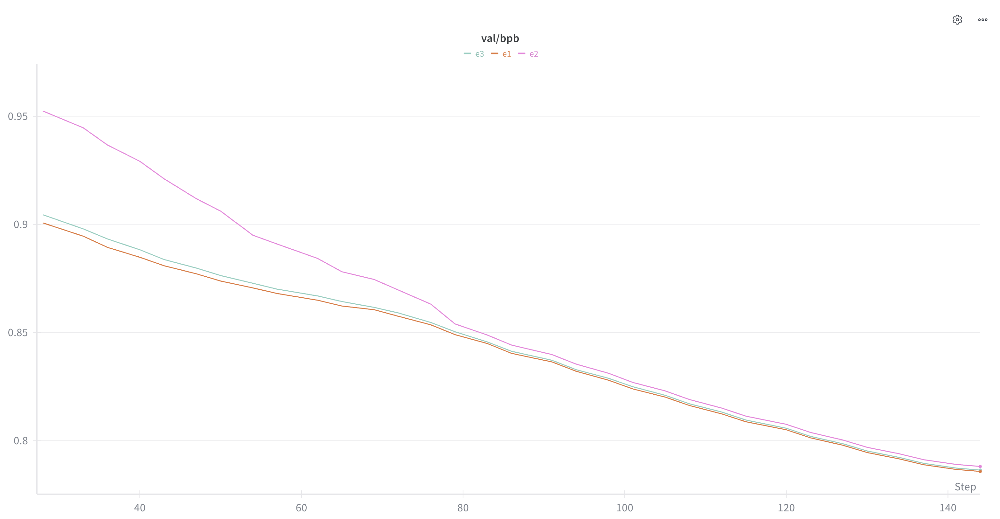

# Drop-Loss: Automated Curriculum Learning for LLM Pretraining

This is a fork of [Andrej Karpathy's nanochat](https://github.com/karpathy/nanochat) used to run a specific experiment: **drop-loss**, a simple automated curriculum learning technique for language model pretraining.

## The Idea

During pretraining, not all tokens are equally learnable. Some tokens are easy (common patterns, predictable continuations), while others are hard (rare facts, noisy data, inherently ambiguous). Standard training treats all tokens equally, but what if we let the model focus on the easy stuff first?

**Drop-loss** works by excluding the highest-loss tokens from the backward pass during the early phase of training. Concretely:

1. Compute per-token cross-entropy loss as usual
2. Find the top X% of tokens with the highest loss
3. Zero out their contribution to the loss (and therefore the gradient)
4. Only backpropagate through the remaining "easier" tokens
5. Gradually reduce the drop percentage over training until all tokens are included

This fits into the broader family of **continuation methods** -- optimization techniques that solve a series of progressively harder problems. The loss function starts easy (ignoring the hardest 10% of tokens) and gradually becomes the standard loss (all tokens included). It can also be viewed as a form of **automated curriculum learning**, where the curriculum is defined implicitly by the model's own loss landscape rather than by hand-crafted heuristics.

### Schedule

For the main experiment, the schedule is:
- **Start**: drop the top 10% highest-loss tokens
- **Decay**: linearly reduce to 0% over the first 50% of training
- **Second half**: standard training with all tokens

## Results

Three experiments were run, all with identical architecture and hyperparameters (depth-20 transformer, ~124M parameters, data:param ratio of 12):

| Experiment | Description | CORE Metric |
|---|---|---|
| **E1** (baseline) | Standard training | 0.2195 |
| **E2** (drop-loss) | Drop top 10% highest-loss tokens, decay to 0% over first half | **0.2338** |
| **E3** (random drop) | Drop random 10% of tokens with same schedule (ablation) | 0.2286 |

### Core Benchmark Results (Centered Accuracy)

The table below focuses on the 9 benchmarks with the strongest signal-to-noise ratio at this model scale (the remaining 13 are too noisy for a model this small to draw conclusions from):

| Benchmark | Shots | E1 (baseline) | E2 (drop-loss) | E3 (random drop) | Winner |
|---|---|---|---|---|---|
| hellaswag_zeroshot | 0 | 0.2756 | **0.2987** | 0.2712 | E2 |
| hellaswag | 10 | 0.2740 | **0.2987** | 0.2778 | E2 |
| piqa | 10 | 0.3602 | **0.4200** | 0.3808 | E2 |
| arc_easy | 10 | 0.5112 | **0.5547** | 0.5123 | E2 |
| lambada_openai | 0 | 0.3811 | **0.3880** | 0.3837 | E2 |
| bigbench_qa_wikidata | 10 | 0.4726 | 0.4840 | **0.4852** | E3 |
| squad | 10 | 0.2747 | **0.3080** | 0.2770 | E2 |
| coqa | 0 | 0.2251 | **0.2440** | 0.2228 | E2 |
| winogrande | 0 | 0.1018 | **0.1800** | 0.1255 | E2 |
| | | | | | |
| **Core Avg** | | 0.3196 | **0.3529** | 0.3263 | **E2** |
| **CORE Metric (all 22)** | | 0.2195 | **0.2338** | 0.2286 | **E2** |
| **Wins** | | 0 | **8** | 1 | |

**E2 (strategic drop-loss) wins 8 out of 9 core benchmarks.** The improvement is consistent across benchmark types: multiple choice, language modeling, and schema tasks all benefit.

### Validation BPB



Interestingly, E2 achieves **slightly worse** validation BPB (bits per byte) than E1, despite performing better on all downstream evaluation benchmarks. This suggests that drop-loss causes the model to allocate capacity toward more "useful" patterns (that help on reasoning/knowledge benchmarks) at the expense of some raw next-token prediction on the validation distribution.

### The Ablation (E3)

E3 uses the same drop-loss schedule and drop percentage, but drops **random** tokens instead of the highest-loss ones. It performs only marginally better than the baseline (within noise), confirming that the **strategic selection** of which tokens to drop is what matters -- not just the regularization effect of training on fewer tokens.

## Limitations

These results are preliminary. Due to limited compute budget, there are several caveats:

- **Single runs only.** Each experiment was run once with a single seed. Without multiple runs per configuration, we cannot compute confidence intervals or rule out that some of the gains are due to lucky initialization. That said, E2's improvement is consistent across 8 of 9 core benchmarks, which is unlikely by chance alone (p ~ 0.02 under a binomial null).
- **Small model scale.** All experiments used a depth-20 (~124M parameter) model. It is unknown whether drop-loss helps, hurts, or has no effect at larger scales (e.g. 1B+ parameters). Curriculum effects may interact differently with model capacity.
- **Limited hyperparameter search.** Only one drop-loss schedule was tested (10% start, linear decay over 50% of training). There may be better schedules -- for example, adding a warmup period so the model learns for a few steps before the curriculum kicks in, or using different decay curves.
- **Single dataset.** All experiments used the same FineWeb pretraining data. The effectiveness of drop-loss may depend on data quality and noise characteristics.

I would love to explore these directions with more compute. If you find these results interesting and have the resources to scale them up, I'd be happy to collaborate or hear about your findings.

## How to Run

### Requirements

- 8x H100 (80GB SXM5) GPU node
- The experiments were run on [Lambda](https://lambda.ai/) GPU cloud

### Step 1: Setup

Clone and run the pre-experiment setup script, which installs dependencies, downloads data, and trains the tokenizer:

```bash
git clone https://github.com/<your-username>/nanochat.git
cd nanochat
bash runs/pre-experiments.sh
```

### Step 2: (Optional) Enable wandb logging

```bash
export WANDB_API_KEY=<your-wandb-api-key>
```

### Step 3: Run experiments

Run each experiment one at a time. Each takes approximately 20-30 minutes on 8x H100:

```bash
# E1: Baseline (standard training)
bash runs/experiment1.sh

# E2: Drop-loss (the main experiment)
bash runs/experiment2.sh

# E3: Random drop-loss (ablation)
bash runs/experiment3.sh
```

Each script trains the model and then runs the full CORE evaluation suite automatically.

## Repo Structure

```
.
├── README.md
├── nanochat/                    # Core library (from upstream nanochat)
│   └── gpt.py                  # Modified: added drop-loss to forward()
├── scripts/
│   └── base_train.py           # Modified: added drop-loss CLI args and schedule
├── runs/
│   ├── pre-experiments.sh      # Setup: installs deps, downloads data, trains tokenizer
│   ├── experiment1.sh          # E1: baseline
│   ├── experiment2.sh          # E2: drop-loss (main experiment)
│   └── experiment3.sh          # E3: random drop-loss (ablation)
└── experiment/
    ├── results/                # Raw eval outputs and comparison CSVs
    │   ├── e1_eval.md
    │   ├── e2_eval.md
    │   ├── e3_eval.md
    │   ├── eval_report_core.csv
    │   ├── eval_comparison_all.csv
    │   ├── eval_comparison_e2_vs_e1.csv
    │   ├── eval_comparison_e3_vs_e2.csv
    │   └── eval_comparison_e3_vs_e1.csv
    └── assets/                 # Screenshots and figures
        └── val_bpb.png         # Validation BPB chart from wandb
```

## Code Changes

Only two files were modified from upstream nanochat:

1. **`nanochat/gpt.py`** -- Added `drop_top_loss_pct` and `drop_random` parameters to the model's `forward()` method. When active, computes per-token loss, identifies the top-X% highest-loss tokens (or random tokens for the ablation), and zeros out their contribution before backpropagation.

2. **`scripts/base_train.py`** -- Added CLI arguments for the drop-loss schedule (`--drop-loss-start`, `--drop-loss-end`, `--drop-loss-warmup-ratio`, `--drop-loss-decay-ratio`, `--drop-loss-random`) and a scheduler that linearly decays the drop percentage over training.

## Acknowledgements

- [Andrej Karpathy](https://github.com/karpathy) for [nanochat](https://github.com/karpathy/nanochat), the base repo this experiment is built on
- [Lambda](https://lambda.ai/) for providing the free GPU credits used to run these experiments
